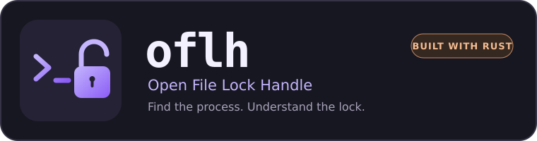

<p align="center">
  
</p>

# oflh — Find locked files and the processes using them

[](https://github.com/karimz1/open-file-lock-handle/releases)
[](#performance)
[](https://github.com/karimz1/open-file-lock-handle/actions/workflows/ci.yml)
[](#platform-behavior)
[](LICENSE)
[](https://awesometui.com/open-file-lock-handle)
[](https://buymeacoffee.com/karimz1)

**Open File Lock Handle (`oflh`) is a native Rust terminal tool for finding which
processes are using a file or directory on Windows, Linux, and macOS.** Inspect
open file handles, mapped files, DLLs, and available lock evidence in one searchable
interface, then request process termination when needed.

<a href="images/demo.gif">
  
</a>

For a higher-quality preview, watch the [terminal recording on asciinema](https://asciinema.org/a/HVwfkoVJfOi5ckDa).

UI preview with sample processes and paths.

Use it to investigate **“file in use by another process”**, a build that cannot
replace a DLL, or a directory held open by a background application.

```sh
oflh ./build             # Find processes using a directory
oflh ./build/plugin.dll  # Investigate a specific file or DLL
oflh .                   # Inspect the current directory
```

**Start here:** [Install](#installation) · [Quick start](#getting-started) ·
[Go vs Rust performance](#performance) · [Keyboard shortcuts](#keyboard-reference) ·
[Platform coverage](#platform-behavior) · [Report a bug](https://github.com/karimz1/open-file-lock-handle/issues) ·
[Donate](https://buymeacoffee.com/karimz1)

## Installation

### Homebrew

On macOS or Linux:

```sh
brew install karimz1/tap/oflh
```

To update:

```sh
brew update
brew upgrade oflh
```

### Standalone binaries

Download the executable for your platform from
[GitHub Releases](https://github.com/karimz1/open-file-lock-handle/releases).

| Platform | Architectures |
| --- | --- |
| Linux | x86-64, ARM64 |
| macOS | Intel, Apple Silicon |
| Windows | x86-64, ARM64 |

On Windows, rename the executable to `oflh.exe` and place it in a directory on
`PATH`. On Linux and macOS, rename it to `oflh`, run `chmod +x oflh`, and place it
in a directory on `PATH`.

Releases include `checksums.txt` for SHA-256 verification.

### Build from source

Install Rust with rustup. The repository pins its toolchain. From a checkout:

```sh
cargo build --release --locked --bin oflh
./target/release/oflh .
```

On Windows:

```powershell
cargo build --release --locked --bin oflh
.\target\release\oflh.exe .
```

## Getting started

Run `oflh` in an interactive terminal:

```sh
oflh                          # Current directory
oflh ./build                  # Directory and its descendants
oflh ./build/plugin.dll       # One file
oflh "/path/with spaces"      # Quote paths containing spaces
```

1. Use **Processes** (`1`) to see processes referencing the target path.
2. Press `/` to search, then `Enter` to finish typing.
3. Press `Enter` on a process to inspect its individual file usages.
4. Use **Locked files** (`2`) to narrow the list to files with lock or sharing-conflict evidence.
5. Press `r` to rescan, or `a` to enable five-second auto-refresh.

In process details, `r` refreshes file usages and metrics; `a` toggles the same
auto-refresh used by the main view. Search and lock filters remain active.

In process details, `l` toggles **Locks only** without clearing the search. The
summary counts distinct locked paths among the displayed usages. Lock labels
appear in muted red. The selected filename appears above the table, and its full
path appears below it. Use `←` and `→` to page through a long path.

On wide terminals, the side panel shows the selected process, its ancestry,
resource usage, and path details. Compact terminals retain resource and parent
information in the process details view.

### Terminal recommendation

For the best visual experience, use a terminal with true-color and Unicode
support, with enough width for the process table and side panel. I recommend
[Ghostty](https://ghostty.org/docs) on macOS and Linux. This is a personal
recommendation; I am not affiliated with the project. Ghostty is optional, and
`oflh` does not depend on a particular terminal emulator.

## Performance

Starting with v0.1.0, `oflh` uses Rust for the application and release tooling. The UI uses Ratatui; scanners call native OS interfaces.
Background scans keep input responsive, resource sampling avoids a second file
scan, and compiled search fields reuse matching buffers. Tests and developer tools
are excluded from the distributed executable.

Measured against the preceding Go implementation on the **same Linux x86-64
workstation and fixture**:

| Operation | Go | Rust |
| --- | ---: | ---: |
| First terminal frame, median | 42.5 ms | **1.7 ms** |
| Directory scan, median | 218.8 ms | **100.6 ms** |
| Directory scan, p95 | 227.8 ms | **114.7 ms** |
| Single-file scan, median | 218.4 ms | **96.8 ms** |
| Missing-file scan, median | 208.9 ms | **108.0 ms** |
| TUI memory after startup, median | 16,840 KiB | **4,436 KiB** |
| Stripped executable size | 4.32 MiB | **1.04 MiB** |

Thirty warm scans per target and five startup runs; 512 open handles, 64 mappings,
and 16 locks. Both scanners produced identical observation rows for this fixture.
Results depend on the workload and machine. This comparison covers Linux;
Windows and macOS timings are not included. See the [methodology, raw results, and limitations](docs/performance.md).

## Why oflh?

A build cannot replace a DLL. A file reports "in use by another process." A
background application still references a directory you want to clean up.
The useful starting point is often a path, rather than a process name or PID.

`oflh` follows that workflow: choose the file or directory, find its users,
inspect the evidence, and decide whether to stop a process or its parent. It
brings file-handle inspection and process control into one keyboard-driven
interface, with searchable results and a separate view for locked files.

It is useful alongside tools such as `lsof`, `fuser`, and Task Manager. It does
not bypass operating-system permissions or guarantee that every file lock is
visible. See [Platform behavior](#platform-behavior) for the detection scope.

### What makes it different

`oflh` is path-first. Run `oflh .` on a folder and get a searchable view of visible
processes using it, including process ancestry and the files each process has open,
mapped, or locked.

From the same TUI you can inspect detailed file usage, switch to a dedicated
locked-files view, sort and filter results, and terminate the process or one of
its parents when needed.

Search is inspired by JetBrains-style navigation, with fragments, CamelCase
abbreviations, and wildcards for quickly narrowing file names.

| Search | Example match |
| --- | --- |
| `dll` | `plugin.dll` |
| `MIMJWT` | `Microsoft.IdentityModel.JsonWebTokens.dll` |
| `micro*dll` | `Microsoft.IdentityModel.JsonWebTokens.dll` |
| `FLEC*` | `FileLockExampleCli.dll`, `FileLockExampleCli.deps.json` |
| `FLEC*.json` | `FileLockExampleCli.deps.json` |

## Search

Search is case-insensitive and updates as you type. The same rules apply to
Processes, Locked files, and process details.

| Query | Meaning |
| --- | --- |
| `dll` | A contiguous fragment, such as the extension in `plugin.dll` |
| `MIMJWT` | Word or CamelCase prefixes in `Microsoft.IdentityModel.JsonWebTokens.dll` |
| `micro*dll` | Chunks `micro` and `dll`, in that order |
| `FLEC.` / `FLEC*` | Abbreviated stem in `FileLockExampleCli.dll` or `FileLockExampleCli.deps.json` |
| `FLEC*.json` | Abbreviated stem followed by a `.json` fragment |
| `*.dll` | A field containing `.dll` |
| `micro*dll mapped` | Both terms must match |

Plain terms match contiguous fragments or word/CamelCase prefixes. They do not
match arbitrary scattered letters across a path. `*` matches zero or more
characters, including path separators. Each chunk between wildcards supports
the same fragment and abbreviation matching. Punctuation remains literal, so
`FLEC.` requires a dot after the abbreviated stem. Patterns can match anywhere in a field;
`*.dll` is not restricted to a filename ending in `.dll`.

Filename and process-name matches rank above directory-only matches. Choosing
an explicit sort order, such as CPU or PID, overrides relevance ordering.

The matched path and `+N` count follow the active filter. When you open process
details, file-related terms carry into the details search. Process-only terms,
such as a PID, stay in the main search. Press `Esc` in details to clear its search
and see all usages again.

## Process actions

Press `Space` to select processes, or `Ctrl+A` to select or deselect all visible
processes. Selections survive filtering, so a selection may include processes
that are no longer visible.

- `k` requests normal termination of the selection, or the current process if nothing is selected.
- `x` force kills the same targets.
- Every action requires confirmation, with **Cancel** selected by default. The dialog lists the targets, including hidden selections.

To act on a parent, press `Tab` or `→` to focus the ancestry tree. It initially
selects the current process. Use `↑` to move toward its parents and `↓` to return
toward the current process. Here, `k` and `x` apply only to the highlighted tree
node, regardless of selections in the main list.

The tree retains its captured process identities across refreshes. Before
termination, the backend revalidates the target to guard against PID reuse.
Protected processes and ancestors without an available identity cannot be
stopped. A successful termination request returns focus to the results and
refreshes the list.

Stopping a parent may close its application and affect its children. It does not
recursively terminate the entire tree. `oflh` does not directly unlock files;
terminating a process may release the resources it holds.

## Keyboard reference

| Context | Key | Action |
| --- | --- | --- |
| Main view | `1` / `2` | Processes / Locked files |
| Lists | `↑` / `↓` | Move selection |
| Main view | `Enter` | Inspect process usages |
| Main view or details | `/` | Start search |
| Search input | `Enter` / `Esc` | Apply / cancel editing |
| Main view | `Space` | Select or deselect process |
| Main view | `Ctrl+A` | Select or deselect all visible processes |
| Process actions | `k` / `x` | Normal termination / force kill |
| Main view | `K` / `X` | Act on selection, or all filtered processes if none selected |
| Main view or details | `r` / `a` | Refresh / toggle auto-refresh |
| Main view | `n` / `p` | Sort by name / PID |
| Main view | `m` / `c` | Sort by RAM / CPU, highest first |
| Main view | `i` | Toggle side panel |
| Main view | `Tab` / `→` | Focus ancestry tree |
| Ancestry tree | `Tab` / `←` / `Esc` | Return to results |
| Ancestry tree | `Home` / `End` | Select root / current process |
| Process details | `l` | Toggle Locks only |
| Process details | `←` / `→` | Page through selected path |
| Navigation | `Esc` | Clear search, cancel, or go back |
| Navigation | `?` | Show help |
| Navigation | `R` / `D` | Open repository / donation page in your default browser |
| Navigation | `q` / `Ctrl+C` | Back / quit |

Only `1` and `2` switch tabs. `Tab` changes table/tree focus or selects a dialog
action. Selected **Cancel** has a green background; selected **Terminate** or
**Force kill** has a red background. A pointer also identifies the choice, and
Cancel remains the default. `R` and `D` open GitHub and Donate; Help shows both
URLs near the top. While editing a search, it stays in the search input.

## Platform behavior

The workflow is shared across platforms, but discovery and lock semantics depend
on the operating system. Results are a snapshot of what the current user can
inspect. Permissions, process exits, and concurrent file activity can limit them.
When a scan has limitations, the footer shows "Results may be incomplete."
Press `?` for the full scan details.

### File discovery and termination

| Platform | Discovery | Normal termination (`k`) |
| --- | --- | --- |
| Linux | `/proc`: file descriptors, CWD, executable, mapped files, deleted-but-open files | `SIGTERM` with `pidfd` identity validation |
| macOS | `libproc`: vnode descriptors, CWD, executable, mapped files | `SIGTERM` after start-time validation |
| Windows | Restart Manager, Toolhelp modules and executables | `WM_CLOSE` for process windows |

Windows console and service processes may require explicit force termination.
Windows discovery does not cover CWD, directory handles, or deleted files.
On Linux, other mount namespaces may require running `oflh` inside the relevant
container. Elevated privileges can improve visibility but do not remove every
platform limitation.

### Lock evidence

An open file is not necessarily locked. The Locked files view requires additional
evidence:

| Platform | Evidence | Scope |
| --- | --- | --- |
| Linux | Held FLOCK, POSIX, and OFD locks from `/proc/PID/fdinfo` | Subject to permissions, namespaces, and scan timing |
| macOS | POSIX byte-range conflicts queried with `F_GETLK` | First conflicting range per readable file; flock-only locks and additional ranges may be missed |
| Windows | Read, write, or delete sharing conflicts, correlated with Restart Manager resource users | Reported users are labeled **owner unverified**; byte-range locks are not enumerated |

On Windows, a sharing conflict confirms the file is restricted, but does not
prove which reported process imposed that restriction. Permission-denied errors
alone are never classified as locks. Lock queries do not modify file contents.
Advisory locks do not necessarily prevent ordinary reads or writes.

### Access modes

The **ACCESS** column summarizes the usages matching the current search.
`read/write` means both modes were observed, possibly on different files. `cwd`
means the process uses the folder as its working directory; it does not imply
read or write access. These labels describe observed access modes, not live I/O
activity or proof of a lock.

Read access uses green, write access uses amber, and confirmed locks use muted
red. Text labels carry the meaning without relying on color.

### CPU, memory, and ancestry

All three platforms collect resident memory and up to eight observed ancestors.
Memory is RSS on Unix and working set on Windows.

CPU measures a process's share of total machine capacity over the sampling
interval: 100% means all CPUs. It requires two samples of the same process. A
lightweight metrics sample runs about one second after the initial results;
use `a` for regular updates. Unavailable metrics appear as a dash, for example when
permissions or process exit prevent inspection.

## Testing and development

CI runs on native Linux, macOS, and Windows runners for both x86-64 and ARM64.
The release workflow uses the same six-platform matrix.

The tests cover real process discovery, memory, two-sample CPU, parent identity,
platform-specific lock evidence, stale-identity rejection, and force termination
of isolated test processes and a parent discovered through its child. Tests also
check lock release on refresh, POSIX read/write/range locks, and Windows
read/write/delete sharing conflicts. An ordinary open file is checked separately to
ensure it is not reported as locked.

TUI tests cover search, selection, ancestry, safe confirmation, and responsive
layouts. A real PTY/ConPTY test checks native startup, input, resizing, and quit.
Four small `.txt` fixtures record expected screens for regression checks; they
are test data, not runtime files or application dependencies.

```sh
cargo xtask check  # rustfmt, Clippy, and workspace tests
```

See [Contributing](CONTRIBUTING.md) to get started, [Development](docs/development.md)
for build and test commands, and [Architecture](docs/architecture.md) for design
and safety boundaries. Maintainers can find packaging instructions in [Releasing](docs/releasing.md).

## Project information

`oflh` is in beta. Report bugs and platform-specific behavior through
[GitHub Issues](https://github.com/karimz1/open-file-lock-handle/issues).
Include the version, operating system, and steps to reproduce the problem.

Early releases used the name `grip`. The project was renamed to Open File Lock
Handle (`oflh`) in v0.0.5.

Licensed under [MIT](LICENSE). To support development, you can
[buy me a coffee](https://buymeacoffee.com/karimz1).
